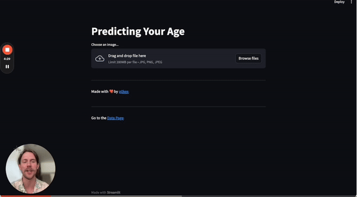

<h1 align="center">Hey there I'm Dan 👋</h1>

<!--
**danp0kes/danp0kes** is a ✨ _special_ ✨ repository because its `README.md` (this file) appears on your GitHub profile.

Here are some ideas to get you started:
-->

- 🔭 Working on machine learning models for media marketers at **Melbrand Studios** <!--- 🌱 Currently learning **** -->
- 📈 Completed projects in machine learning with business, texts, computer vision, and unsupervised learning models.
- 👯 Looking to collaborate on **data science related** projects within finance
- 🤞 And I'm building my first Gameboy

Check out my [portfolio.](https://github.com/danp0kes/triple-ten-projects)

---

<h2 align='left'> Projects </h2>

<h3 align='left'> Age Verification </h3>

<table>
  <tr>
    <td>
      
    </td>
    <td>Ever wanted to know how old you look based on a photo? In this <a href="https://github.com/danp0kes/age-predictor" target="_blank">project</a>, I use TensorFlow to create a model that predicts your age.   

Application: Eliminates the need for manual age verification for over half of all customers purchasing alcohol.

</td>
  </tr>
</table>
