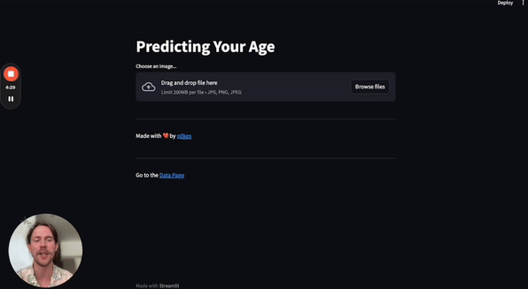

<h1 align="center">Hey there I'm Dan 👋</h1>

<!--
**danp0kes/danp0kes** is a ✨ _special_ ✨ repository because its `README.md` (this file) appears on your GitHub profile.

Here are some ideas to get you started:
-->

- 🔭 Working on machine learning models for media marketers at **Melbrand Studios** <!--- 🌱 Currently learning **** -->
- 📈 Completed projects in machine learning with business, texts, computer vision, and unsupervised learning models.
- 👯 Looking to collaborate on **data science related** projects within finance
- 🤞 And I'm building my first Gameboy

Check out my [portfolio.](https://github.com/danp0kes/triple-ten-projects)

---

<h2 align='left'> Projects </h2>

<h3 align='left'> Age Verification </h3>

<table>
  <tr>
    <td>
      
    </td>
    <td>Ever wanted to know how old you look based on a photo? In this project, I use TensorFlow to create a model that predicts your age within 6.1 years of your actual age. 
    
- How the model was developed 🛠️
- Its performance (the highs and the lows) 📊
- Real-world implications 🌎

One cool advantage is that it could eliminate the need for manual age verification for over half of all customers purchasing alcohol (that is when customers aren’t gaming the system of course).

</td>
  </tr>
</table>

